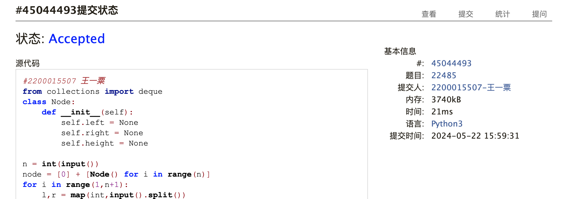
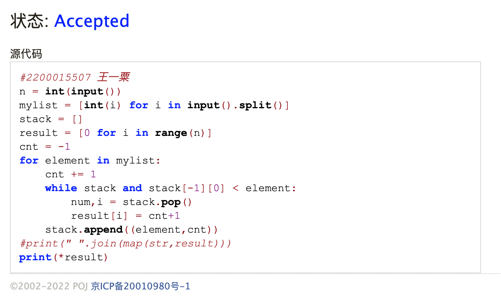
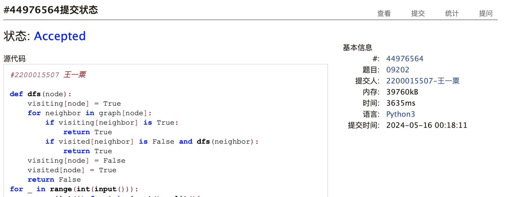
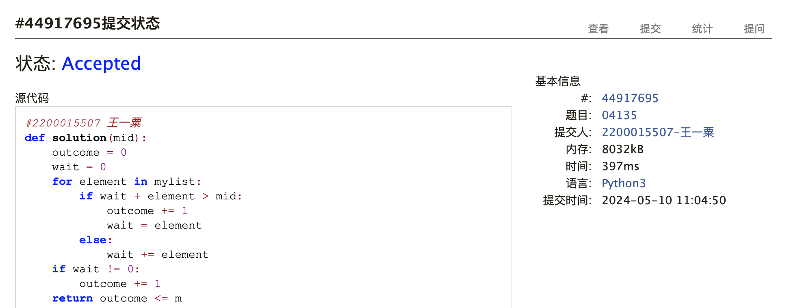
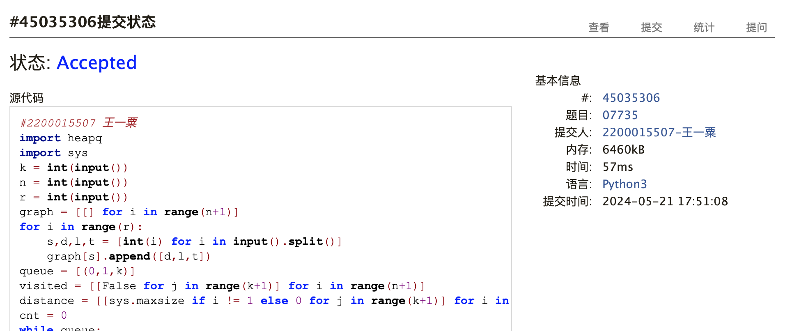
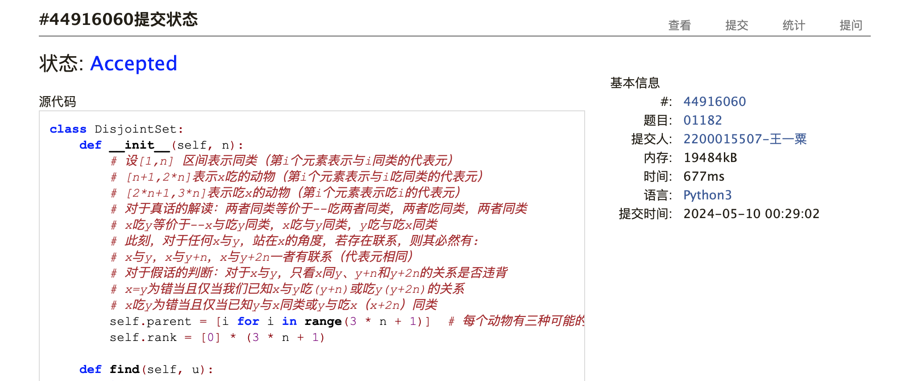

# Assignment #F: All-Killed 满分

Updated 1844 GMT+8 May 20, 2024

2024 spring, Complied by ==王一粟 经济学院==


**说明：**

1）请把每个题目解题思路（可选），源码Python, 或者C++（已经在Codeforces/Openjudge上AC），截图（包含Accepted），填写到下面作业模版中（推荐使用 typora https://typoraio.cn ，或者用word）。AC 或者没有AC，都请标上每个题目大致花费时间。

2）提交时候先提交pdf文件，再把md或者doc文件上传到右侧“作业评论”。Canvas需要有同学清晰头像、提交文件有pdf、"作业评论"区有上传的md或者doc附件。

3）如果不能在截止前提交作业，请写明原因。


**编程环境**

==（请改为同学的操作系统、编程环境等）==

操作系统：macOS Ventura 13.4.1 (c)

Python编程环境：Spyder IDE 5.2.2, PyCharm 2023.1.4 (Professional Edition)

C/C++编程环境：Mac terminal vi (version 9.0.1424), g++/gcc (Apple clang version 14.0.3, clang-1403.0.22.14.1)


## 1. 题目

### 22485: 升空的焰火，从侧面看

http://cs101.openjudge.cn/practice/22485/

思路：按层次遍历的时候标记一下层次，对每层最后一个节点输入到答案中就可以

耗时：25min

代码

```python
#2200015507 王一粟
from collections import deque
class Node:
    def __init__(self):
        self.left = None
        self.right = None
        self.height = None

n = int(input())
node = [0] + [Node() for i in range(n)]
for i in range(1,n+1):
    l,r = map(int,input().split())
    if l != -1:
        node[i].left = l
    if r != -1:
        node[i].right = r
node[1].height = 0
prev = -1
h = 0
queue = deque([1])
result = []
while queue:
    idx = queue.popleft()
    if node[idx].height > h:
        result.append(prev)
        h += 1
    if node[idx].left:
        node[node[idx].left].height = node[idx].height + 1
        queue.append(node[idx].left)
    if node[idx].right:
        node[node[idx].right].height = node[idx].height + 1
        queue.append(node[idx].right)
    prev = idx
result.append(prev)
print(*result)
```

代码运行截图 ==（至少包含有"Accepted"）==




### 28203:【模板】单调栈

http://cs101.openjudge.cn/practice/28203/

思路：经典的单调栈思路（发现输出方法对于内存的影响还挺大的...

耗时：25min

代码

```python
#2200015507 王一粟
n = int(input())
mylist = [int(i) for i in input().split()]
stack = []
result = [0 for i in range(n)]
cnt = -1
for element in mylist:
    cnt += 1
    while stack and stack[-1][0] < element:
        num,i = stack.pop()
        result[i] = cnt+1
    stack.append((element,cnt))
#print(" ".join(map(str,result)))，这种输出会MLE
print(*result)
```

代码运行截图 ==（至少包含有"Accepted"）==




### 09202: 舰队、海域出击！

http://cs101.openjudge.cn/practice/09202/


思路：可以拓扑排序，也可以考虑做visited/visiting的标记去处理

耗时：2h（最初没有visiting，没有考虑到两种路径可以到达不代表成环的情况

代码

```python
#2200015507 王一粟

def dfs(node):
    visiting[node] = True
    for neighbor in graph[node]:
        if visiting[neighbor] is True:
            return True
        if visited[neighbor] is False and dfs(neighbor):
            return True
    visiting[node] = False
    visited[node] = True
    return False
for _ in range(int(input())):
    n,m = [int(i) for i in input().split()]
    graph = [0] + [[] for i in range(n)]
    for i in range(m):
        x,y = [int(i) for i in input().split()]
        graph[x].append(y)
    visited = [False for i in range(n+1)]
    visiting = [False for i in range(n+1)]
    cnt = 0
    for element in range(1,n+1):
        if visited[element] is False:
            if dfs(element) is True:
                cnt = 1
                print("Yes")
                break
    if cnt == 0:
        print("No")
```




代码运行截图 ==（AC代码截图，至少包含有"Accepted"）==


### 04135: 月度开销

http://cs101.openjudge.cn/practice/04135/


思路：二分搜索

耗时：30min

代码

```python
#2200015507 王一粟
def solution(mid):
    outcome = 0
    wait = 0
    for element in mylist:
        if wait + element > mid:
            outcome += 1
            wait = element
        else:
            wait += element
    if wait != 0:
        outcome += 1
    return outcome <= m
n,m = [int(i) for i in input().split()]
max_num = 0
total = 0
mylist = []
for _ in range(n):
    num = int(input())
    max_num = max(max_num,num)
    mylist.append(num)
    total += num
start = max_num - 1
end = total
mid = (start+end)//2
while mid > start:
    if solution(mid):
        end = mid
        mid = (start+end)//2
    else:
        start = mid
        mid = (start+end)//2
print(end)
```


代码运行截图 ==（AC代码截图，至少包含有"Accepted"）==




### 07735: 道路

http://cs101.openjudge.cn/practice/07735/

思路：比较重要的是想明白如何剪枝，这里我考虑了到达每个节点、以及剩余money的情况

耗时：45min

代码

```python
#2200015507 王一粟
import heapq
import sys
k = int(input())
n = int(input())
r = int(input())
graph = [[] for i in range(n+1)]
for i in range(r):
    s,d,l,t = [int(i) for i in input().split()]
    graph[s].append([d,l,t])
queue = [(0,1,k)]
visited = [[False for j in range(k+1)] for i in range(n+1)]
distance = [[sys.maxsize if i != 1 else 0 for j in range(k+1)] for i in range(n+1)]
cnt = 0
while queue:
    dis,spot,money = heapq.heappop(queue)
    if visited[spot][money] is True:
        continue
    visited[spot][money] = True
    if spot == n:
        cnt = 1
        print(dis)
        break
    for neighbor,inter_distance,cost in graph[spot]:
        if cost <= money and visited[neighbor][money-cost] is False:
            if dis + inter_distance < distance[neighbor][money-cost]:
                distance[neighbor][money-cost] = dis + inter_distance
                heapq.heappush(queue,(dis+inter_distance,neighbor,money-cost))
if cnt == 0:
    print(-1)
```


代码运行截图 ==（AC代码截图，至少包含有"Accepted"）==




### 01182: 食物链

http://cs101.openjudge.cn/practice/01182/


思路：并查集，注意每一个数据带给我们的全部信息

耗时：1h

代码

```python
class DisjointSet:
    def __init__(self, n):
        # 设[1,n] 区间表示同类（第i个元素表示与i同类的代表元）
        # [n+1,2*n]表示x吃的动物（第i个元素表示与i吃同类的代表元）
        # [2*n+1,3*n]表示吃x的动物（第i个元素表示吃i的代表元）
        # 对于真话的解读：两者同类等价于--吃两者同类，两者吃同类，两者同类
        # x吃y等价于--x与吃y同类，x吃与y同类，y吃与吃x同类
        # 此刻，对于任何x与y，站在x的角度，若存在联系，则其必然有:
        # x与y，x与y+n，x与y+2n一者有联系（代表元相同）
        # 对于假话的判断：对于x与y，只看x同y、y+n和y+2n的关系是否违背
        # x=y为错当且仅当我们已知x与y吃(y+n)或吃y(y+2n)的关系
        # x吃y为错当且仅当已知y与x同类或y与吃x（x+2n）同类
        self.parent = [i for i in range(3 * n + 1)]  # 每个动物有三种可能的类型，用 3 * n 来表示每种类型的并查集
        self.rank = [0] * (3 * n + 1)

    def find(self, u):
        if self.parent[u] != u:
            self.parent[u] = self.find(self.parent[u])
        return self.parent[u]

    def union(self, u, v):
        pu, pv = self.find(u), self.find(v)
        if pu == pv:
            return False
        if self.rank[pu] > self.rank[pv]:
            self.parent[pv] = pu
        elif self.rank[pu] < self.rank[pv]:
            self.parent[pu] = pv
        else:
            self.parent[pv] = pu
            self.rank[pu] += 1
        return True


def is_valid(n, statements):
    dsu = DisjointSet(n)

    def find_disjoint_set(x):
        if x > n:
            return False
        return True

    false_count = 0
    for d, x, y in statements:
        if not find_disjoint_set(x) or not find_disjoint_set(y):
            false_count += 1
            continue
        if d == 1:  # X and Y are of the same type
            if dsu.find(x) == dsu.find(y + n) or dsu.find(x) == dsu.find(y + 2 * n):
                false_count += 1
            else:
                dsu.union(x, y)
                dsu.union(x + n, y + n)
                dsu.union(x + 2 * n, y + 2 * n)
        else:  # X eats Y
            if dsu.find(x) == dsu.find(y) or dsu.find(x + 2 * n) == dsu.find(y):
                false_count += 1
            else:  # [1,n] 区间表示同类，[n+1,2*n]表示x吃的动物，[2*n+1,3*n]表示吃x的动物
                dsu.union(x + n, y)  # x吃的动物与y同类
                dsu.union(x, y + 2 * n)  # 吃y的动物与x同类
                dsu.union(x + 2 * n, y + n)  # 吃x的动物与y吃的动物同类

    return false_count


if __name__ == "__main__":
    N, K = map(int, input().split())
    statements = []
    for _ in range(K):
        D, X, Y = map(int, input().split())
        statements.append((D, X, Y))
    result = is_valid(N, statements)
    print(result)
```

代码运行截图 ==（AC代码截图，至少包含有"Accepted"）==




## 2. 学习总结和收获

==如果作业题目简单，有否额外练习题目，比如：OJ“2024spring每日选做”、CF、LeetCode、洛谷等网站题目。==

最近的每日选做总是WA，很多时候都考虑的不周到，很崩溃