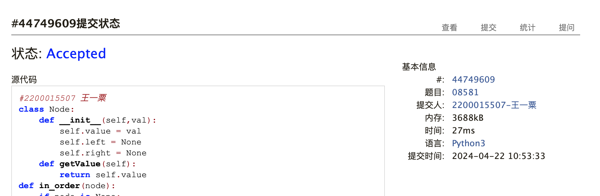
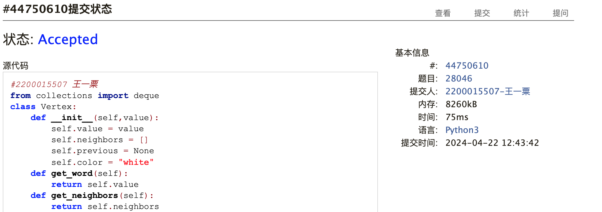

# Assignment #9: 图论：遍历，及 树算

Updated 1739 GMT+8 Apr 14, 2024

2024 spring, Complied by ==王一粟 经济学院==


**说明：**

1）请把每个题目解题思路（可选），源码Python, 或者C++（已经在Codeforces/Openjudge上AC），截图（包含Accepted），填写到下面作业模版中（推荐使用 typora https://typoraio.cn ，或者用word）。AC 或者没有AC，都请标上每个题目大致花费时间。

2）提交时候先提交pdf文件，再把md或者doc文件上传到右侧“作业评论”。Canvas需要有同学清晰头像、提交文件有pdf、"作业评论"区有上传的md或者doc附件。

3）如果不能在截止前提交作业，请写明原因。


**编程环境**

==（请改为同学的操作系统、编程环境等）==

操作系统：macOS Ventura 13.4.1 (c)

Python编程环境：Spyder IDE 5.2.2, PyCharm 2023.1.4 (Professional Edition)

C/C++编程环境：Mac terminal vi (version 9.0.1424), g++/gcc (Apple clang version 14.0.3, clang-1403.0.22.14.1)


## 1. 题目

### 04081: 树的转换

http://cs101.openjudge.cn/dsapre/04081/


思路：先做树的解析，同时确认初始高度。转换后的高度，等价于去判断根节点各子树的高度+索引位置的大小

耗时：25min

代码

```python
#2200015507 王一粟
class Node:
    def __init__(self):
        self.child = []
    def get_child(self):
        return self.child

def max_height(node):
    ma_height = -1
    for idx,child in enumerate(node.get_child()):
        height = idx + max_height(child)
        if height > ma_height:
            ma_height = height
    return ma_height+1

s = input()
root = Node()
stack = [root]
max_origin = 0
origin = 0
for element in s:
    if element == "d":
        current_node = Node()
        stack[-1].child.append(current_node)
        stack.append(current_node)
        origin = origin + 1
    else:
        max_origin = max(max_origin,origin)
        origin = origin - 1
        stack.pop()
change = max_height(root)
print(f"{max_origin} => {change}")
```


代码运行截图 ==（至少包含有"Accepted"）==


### 08581: 扩展二叉树

http://cs101.openjudge.cn/dsapre/08581/


思路：可以用栈做树的解析，当确认节点的两个子结点已经出现，从栈中弹出

耗时：25min

代码

```python
#2200015507 王一粟
class Node:
    def __init__(self,val):
        self.value = val
        self.left = None
        self.right = None
    def getValue(self):
        return self.value
def in_order(node):
    if node is None:
        return ""
    return in_order(node.left) + node.getValue() + in_order(node.right)
def post_order(node):
    if node is None:
        return ""
    return post_order(node.left)+post_order(node.right)+node.getValue()

s = input()
root = Node(s[0])
stack = [[root,0]]
for element in s[1:]:
    if element == ".":
        if stack[-1][1] == 0:
            stack[-1][1] = 1
        else:
            stack.pop()
    else:
        current_node = Node(element)
        if stack[-1][1] == 0:
            stack[-1][1] = 1
            stack[-1][0].left = current_node
        else:
            stack[-1][0].right = current_node
            stack.pop()
        stack.append([current_node,0])
print(in_order(root))
print(post_order(root))
```


代码运行截图 ==（至少包含有"Accepted"）==



### 22067: 快速堆猪

http://cs101.openjudge.cn/practice/22067/

思路：为了节省时间，采用sequence列表储存最小值的降序序列

耗时：20min

代码

```python
#2200015507 王一粟
stack = []
size = 0
sequence = []
while True:
    try:
        s = input()
        if s == "pop":
            if stack:
                if sequence[-1][1] == size:
                    sequence.pop()
                size -= 1
                stack.pop()
        elif s == "min":
            if sequence:
                print(sequence[-1][0])
        else:
            t,num = s.split()
            num = int(num)
            stack.append(num)
            size += 1
            if sequence:
                if num <= sequence[-1][0]:
                    sequence.append([num,size])
            else:
                sequence.append([num,size])
    except:
        break
```


代码运行截图 ==（AC代码截图，至少包含有"Accepted"）==


### 04123: 马走日

dfs, http://cs101.openjudge.cn/practice/04123

思路：dfs思路，自己主要在考虑如何计数，自己的处理是每次确认一条路径后return1，通过dfs一直向前return结果。

耗时：30min

代码

```python
#2200015507 王一粟
def dfs(n,m,x,y,p):
    if p == n*m:
        return 1
    result = 0
    visited[x][y] = True
    for x1,y1 in [(2,1),(2,-1),(1,2),(1,-2),(-2,1),(-2,-1),(-1,2),(-1,-2)]:
        if 0<=x+x1<n and 0<=y+y1<m and not visited[x+x1][y+y1]:
            result += dfs(n,m,x+x1,y+y1,p+1)
    visited[x][y] = False
    return result
t = int(input())
for _ in range(t):
    n,m,x,y = [int(i) for i in input().split()]
    visited = [[False]*m for _ in range(n)]
    print(dfs(n,m,x,y,1))
```


代码运行截图 ==（AC代码截图，至少包含有"Accepted"）==


### 28046: 词梯

bfs, http://cs101.openjudge.cn/practice/28046/


思路：debug过程中最麻烦的问题是，没有意识到给出的word可能原先不在dict中

耗时：1h，35min在debug

代码

```python
#2200015507 王一粟
from collections import deque
class Vertex:
    def __init__(self,value):
        self.value = value
        self.neighbors = []
        self.previous = None
        self.color = "white"
    def get_word(self):
        return self.value
    def get_neighbors(self):
        return self.neighbors
    def add_neighbor(self,tword):
        self.neighbors.append(tword)
class Graph:
    def __init__(self):
        self.vertices = {}
    def add_edge(self,word1,word2):
        if word1 not in self.vertices:
            self.vertices[word1] = Vertex(word1)
        if word2 not in self.vertices:
            self.vertices[word2] = Vertex(word2)
        self.vertices[word1].add_neighbor(self.vertices[word2])
    def get(self,word):
        if word in self.vertices:
            return self.vertices[word]
        else:
            a = Vertex(word)
            self.vertices[word] = a
            return a
def build_graph(all_words):
    buckets = {}
    the_graph = Graph()
    for word in all_words:
        for i,char in enumerate(word):
            bucket = word[:i]+"_"+word[i+1:]
            buckets.setdefault(bucket,set()).add(word)
    for similar_words in buckets.values():
            for word1 in similar_words:
                for word2 in similar_words-{word1}:
                    the_graph.add_edge(word1,word2)
    return the_graph
def bfs(start_word):
    myqueue = deque([start_word])
    while myqueue:
        current_word = myqueue.popleft()
        for neighbor in current_word.get_neighbors():
            if neighbor.color == "white":
                neighbor.color = "gray"
                neighbor.previous = current_word
                myqueue.append(neighbor)
        current_word.color = "black"
def traceback(the_word):
    result = [the_word.get_word()]
    if the_word.previous is not None:
        result.extend(traceback(the_word.previous))
    return result
n = int(input())
all_words = []
for _ in range(n):
    all_words.append(input())
mygraph = build_graph(all_words)


start,end = input().split()
bfs(mygraph.get(start))
re = traceback(mygraph.get(end))
if re[-1] == start:
    print(" ".join(re[::-1]))
else:
    print("NO")
```


代码运行截图 ==（AC代码截图，至少包含有"Accepted"）==



### 28050: 骑士周游

dfs, http://cs101.openjudge.cn/practice/28050/


思路：同课件。个人感受是这种长代码如果自己编的话，总容易小地方出错，后面debug的过程还是挺艰辛的...

耗时：50min（30min debug）

代码

```python
#2200015507 王一粟
class Vertex:
    def __init__(self,key):
        self.key = key
        self.neighbors = []
        self.color = "white"
    def add_neighbor(self,key2):
        return self.neighbors.append(key2)
class Graph:
    def __init__(self):
        self.vertices = {}
    def add_edges(self,key1,key2):
        if key1 not in self.vertices:
            self.vertices[key1] = Vertex(key1)
        if key2 not in self.vertices:
            self.vertices[key2] = Vertex(key2)
        self.vertices[key1].add_neighbor(key2)
def valid_pos(a,b,n):
    result = []
    for dx,dy in [(-2,-1),(-2,1),(-1,-2),(-1,2),(1,-2),(1,2),(2,-1),(2,1)]:
        if 0<=a+dx<n and 0<=b+dy<n:
            result.append([a+dx,b+dy])
    return result
def order(key):
    mylist = mygraph.vertices[key].neighbors
    operate = []
    for element_key in mylist:
        current_node = mygraph.vertices[element_key]
        if current_node.color == "white":
            c = 0
            for w in current_node.neighbors:
                if mygraph.vertices[w].color == "white":
                    c+=1
            operate.append([element_key,c])
    operate.sort(key = lambda x:x[1])
    return [x[0] for x in operate]
def dfs(x,y,t,n):
    mygraph.vertices[(x,y)].color = "grey"
    if t == n**2:
        return True
    for node in order((x,y)):
        if dfs(node[0],node[1],t+1,n):
            return True
    mygraph.vertices[(x,y)].color = "white"
    return False
n = int(input())
sr,sc = [int(i) for i in input().split()]
mygraph = Graph()
for i in range(n):
    for j in range(n):
        legal_id = valid_pos(i,j,n)
        for p,q in legal_id:
            mygraph.add_edges((i,j),(p,q))
if dfs(sr,sc,1,n):
    print("success")
else:
    print("fail")
```


代码运行截图 ==（AC代码截图，至少包含有"Accepted"）==


## 2. 学习总结和收获

==如果作业题目简单，有否额外练习题目，比如：OJ“2024spring每日选做”、CF、LeetCode、洛谷等网站题目。==

期中考后第一周，首先先补了8-10周的课程内容。因为之前计概C没接触过图论、dfs和bfs，因此学基础内容这块耗费了大量时间。

这两天把9、10两周作业都做了，第十周最后两道有关于权值问题的代码还是TLE，确实有些难度。后面打算看看其他同学的代码学习一下。

估计下周+五一会把每日数算全部补回来。一天连做了9和10两次作业脑子要炸了...
