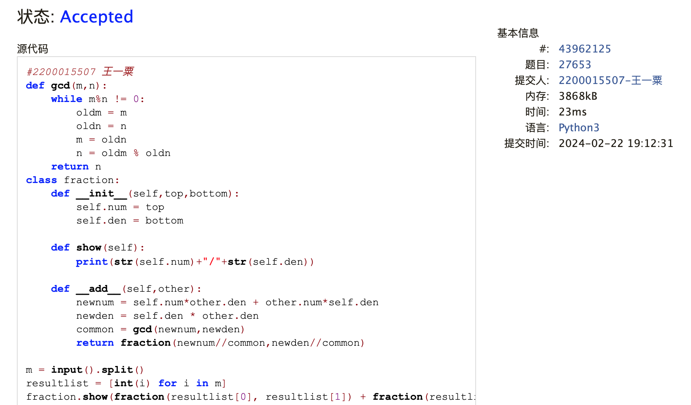
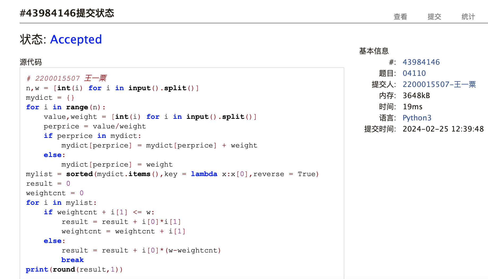
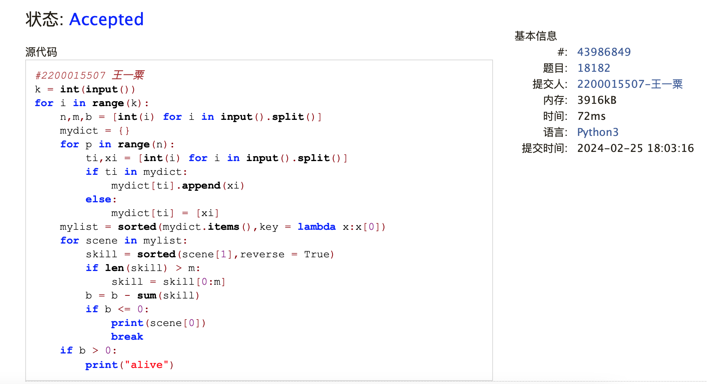
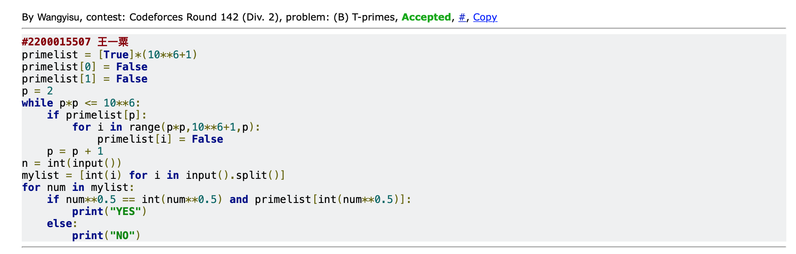
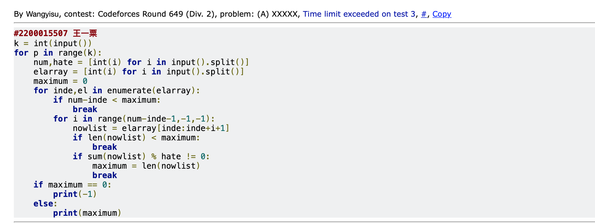
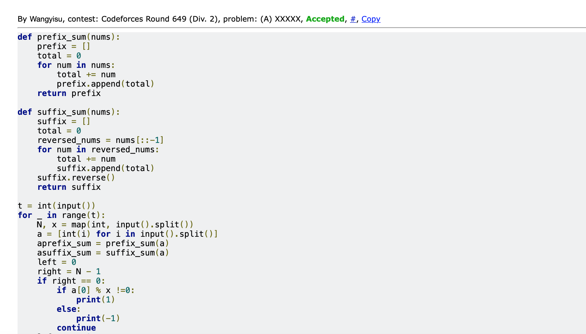
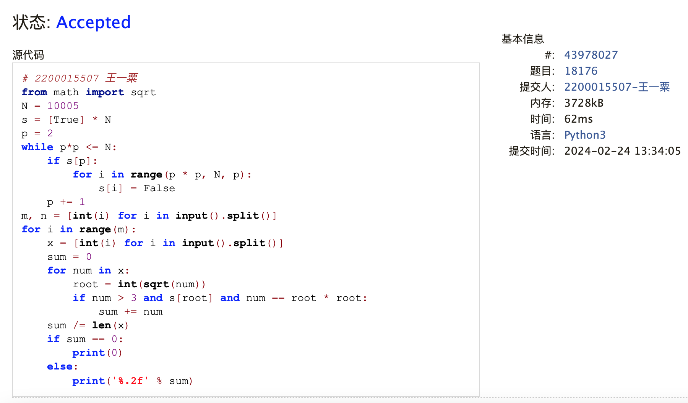

# Assignment #2: 编程练习

Updated 0953 GMT+8 Feb 24, 2024

2024 spring, Complied by ==王一粟 经济学院 2200015507==


**说明：**

1）The complete process to learn DSA from scratch can be broken into 4 parts:
- Learn about Time and Space complexities
- Learn the basics of individual Data Structures
- Learn the basics of Algorithms
- Practice Problems on DSA

2）请把每个题目解题思路（可选），源码Python, 或者C++（已经在Codeforces/Openjudge上AC），截图（包含Accepted），填写到下面作业模版中（推荐使用 typora https://typoraio.cn ，或者用word）。AC 或者没有AC，都请标上每个题目大致花费时间。

3）课程网站是Canvas平台, https://pku.instructure.com, 学校通知3月1日导入选课名单后启用。**作业写好后，保留在自己手中，待3月1日提交。**

提交时候先提交pdf文件，再把md或者doc文件上传到右侧“作业评论”。Canvas需要有同学清晰头像、提交文件有pdf、"作业评论"区有上传的md或者doc附件。

4）如果不能在截止前提交作业，请写明原因。


**编程环境**

==（请改为同学的操作系统、编程环境等）==

操作系统：macOS Ventura 13.4.1 (c)

Python编程环境：Spyder IDE 5.2.2, PyCharm 2023.1.4 (Professional Edition)

C/C++编程环境：Mac terminal vi (version 9.0.1424), g++/gcc (Apple clang version 14.0.3, clang-1403.0.22.14.1)


## 1. 题目

### 27653: Fraction类

http://cs101.openjudge.cn/2024sp_routine/27653/


思路：参照讲义定义类的方式进行定义即可，先定义构造方法，再定义具体函数

耗时：20min

##### 代码

```python
# #2200015507 王一粟
def gcd(m,n):
    while m%n != 0:
        oldm = m
        oldn = n
        m = oldn
        n = oldm % oldn
    return n
class fraction:
    def __init__(self,top,bottom):
        self.num = top
        self.den = bottom

    def show(self):
        print(str(self.num)+"/"+str(self.den))

    def __add__(self,other):
        newnum = self.num*other.den + other.num*self.den
        newden = self.den * other.den
        common = gcd(newnum,newden)
        return fraction(newnum//common,newden//common)

m = input().split()
resultlist = [int(i) for i in m]
fraction.show(fraction(resultlist[0], resultlist[1]) + fraction(resultlist[2], resultlist[3]))
```
代码运行截图 ==（至少包含有"Accepted"）==


### 04110: 圣诞老人的礼物-Santa Clau’s Gifts

greedy/dp, http://cs101.openjudge.cn/practice/04110

思路：
先把所有material输入字典（key是价值比，value是重量），以列表方式排序后取出最前面的对应重量

耗时：20min

##### 代码

```python
# # 2200015507 王一粟
n,w = [int(i) for i in input().split()]
mydict = {}
for i in range(n):
    value,weight = [int(i) for i in input().split()]
    perprice = value/weight
    if perprice in mydict:
        mydict[perprice] = mydict[perprice] + weight
    else:
        mydict[perprice] = weight
mylist = sorted(mydict.items(),key = lambda x:x[0],reverse = True)
result = 0
weightcnt = 0
for i in mylist:
    if weightcnt + i[1] <= w:
        result = result + i[0]*i[1]
        weightcnt = weightcnt + i[1]
    else:
        result = result + i[0]*(w-weightcnt)
        break
print(round(result,1))
```

代码运行截图 ==（至少包含有"Accepted"）==


### 18182: 打怪兽

implementation/sortings/data structures, http://cs101.openjudge.cn/practice/18182/

思路：对每一个case，先按照时间确定每一时刻所用的技能（字典+列表），然后按照时间顺序确定有技能的时刻会掉多少血，直至为0或没有技能后输出alive。

耗时：20min

##### 代码

```python
#2200015507 王一粟
k = int(input())
for i in range(k):
    n,m,b = [int(i) for i in input().split()]
    mydict = {}
    for p in range(n):
        ti,xi = [int(i) for i in input().split()]
        if ti in mydict:
            mydict[ti].append(xi)
        else:
            mydict[ti] = [xi]
    mylist = sorted(mydict.items(),key = lambda x:x[0])
    for scene in mylist:
        skill = sorted(scene[1],reverse = True)
        if len(skill) > m:
            skill = skill[0:m]
        b = b - sum(skill)
        if b <= 0:
            print(scene[0])
            break
    if b > 0:
        print("alive")
```
代码运行截图 ==（AC代码截图，至少包含有"Accepted"）==


### 230B. T-primes

binary search/implementation/math/number theory, 1300, http://codeforces.com/problemset/problem/230/B

思路：和第六题思路趋同，筛法计算效率较高。

耗时：15min

##### 代码

```python
# #2200015507 王一粟
primelist = [True]*(10**6+1)
primelist[0] = False
primelist[1] = False
p = 2
while p*p <= 10**6:
    if primelist[p]:
        for i in range(p*p,10**6+1,p):
            primelist[i] = False
    p = p + 1
n = int(input())
mylist = [int(i) for i in input().split()]
for num in mylist:
    if num**0.5 == int(num**0.5) and primelist[int(num**0.5)]:
        print("YES")
    else:
        print("NO")

```

代码运行截图 ==（AC代码截图，至少包含有"Accepted"）==


### 1364A. XXXXX

brute force/data structures/number theory/two pointers, 1200, https://codeforces.com/problemset/problem/1364/A

思路：自己的代码答案正确但超时，基于答案修改的代码AC。AC的思路，在于先利用函数将sum全部表达出来，再进行索引查找。其中内嵌的事情在于，若子串存在，必然至少有一边在总序列的一端。

耗时：1h

##### 代码

```python
#2200015507 王一粟(myself time limit exceeded)
k = int(input())
for p in range(k):
    num,hate = [int(i) for i in input().split()]
    elarray = [int(i) for i in input().split()]
    maximum = 0
    for inde,el in enumerate(elarray):
        if num-inde < maximum:
            break
        for i in range(num-inde-1,-1,-1):
            nowlist = elarray[inde:inde+i+1]
            if len(nowlist) < maximum:
                break
            if sum(nowlist) % hate != 0:
                maximum = len(nowlist)
                break
    if maximum == 0:
        print(-1)
    else:
        print(maximum)
        
# modified by answer        
def prefix_sum(nums):
    prefix = []
    total = 0
    for num in nums:
        total += num
        prefix.append(total)
    return prefix

def suffix_sum(nums):
    suffix = []
    total = 0
    reversed_nums = nums[::-1]
    for num in reversed_nums:
        total += num
        suffix.append(total)
    suffix.reverse()
    return suffix

t = int(input())
for _ in range(t):
    N, x = map(int, input().split())
    a = [int(i) for i in input().split()]
    aprefix_sum = prefix_sum(a)
    asuffix_sum = suffix_sum(a)
    left = 0
    right = N - 1
    if right == 0:
        if a[0] % x !=0:
            print(1)
        else:
            print(-1)
        continue
    leftmax = 0
    rightmax = 0
    while left != right:
        total = asuffix_sum[left]
        if total % x != 0:
            leftmax = right - left + 1
            break
        else:
            left += 1

    left = 0
    right = N - 1
    while left != right:
        total = aprefix_sum[right]
        if total % x != 0:
            rightmax = right - left + 1
            break
        else:
            right -= 1
    if leftmax == 0 and rightmax == 0:
        print(-1)
    else:
        print(max(leftmax, rightmax))
```

代码运行截图 ==（AC代码截图，至少包含有"Accepted"）==




### 18176: 2050年成绩计算

http://cs101.openjudge.cn/practice/18176/

思路：筛法。本质tprime要的是一个完全平方数，且开根后的数也为质数。先用筛法筛出10000以内的质数，然后再确认tprime

耗时：1h
##### 代码

```python
# # 2200015507 王一粟
from math import sqrt
N = 10005
s = [True] * N
p = 2
while p*p <= N:
    if s[p]:
        for i in range(p * p, N, p):
            s[i] = False
    p += 1
m, n = [int(i) for i in input().split()]
for i in range(m):
    x = [int(i) for i in input().split()]
    sum = 0
    for num in x:
        root = int(sqrt(num))
        if num > 3 and s[root] and num == root * root:
            sum += num
    sum /= len(x)
    if sum == 0:
        print(0)
    else:
        print('%.2f' % sum)
```
代码运行截图 ==（AC代码截图，至少包含有"Accepted"）==


## 2. 学习总结和收获
第六题是本人第一次接触筛法这类题目，最开始没有想到这种方法。第五题同样面临超时的问题。个人的不足在于不能很好地节省算法的时间，算法过于复杂。目前来看，至少化简算法要多用函数；尝试一次性把所有需要索引的内容表示出来而不要每一次遇到都索引一次；化简题目问题。


