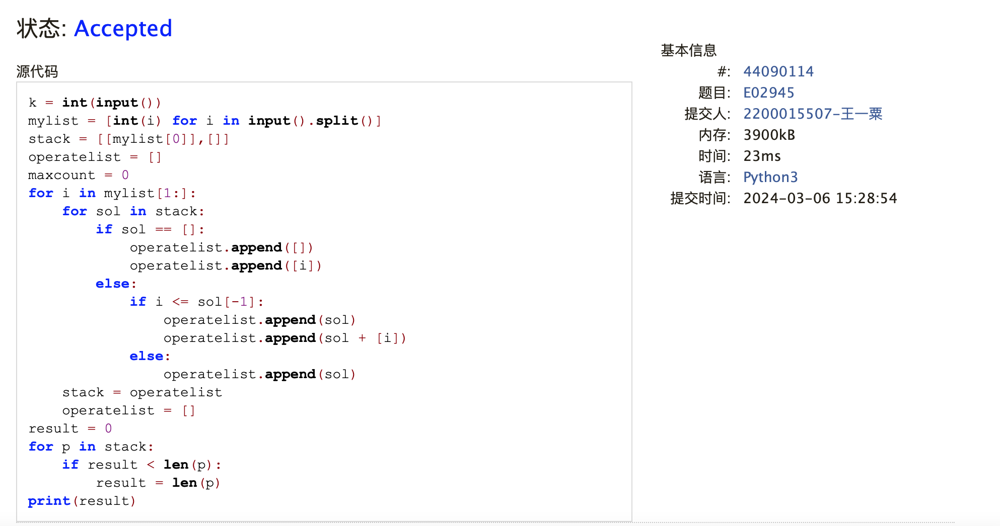
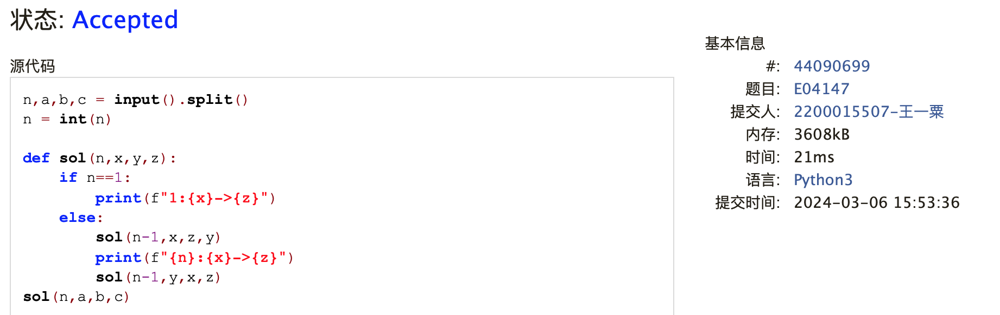
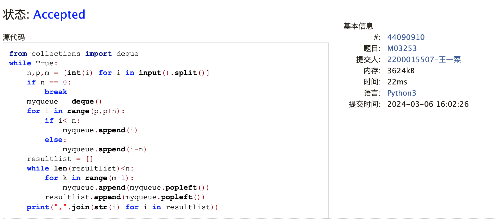
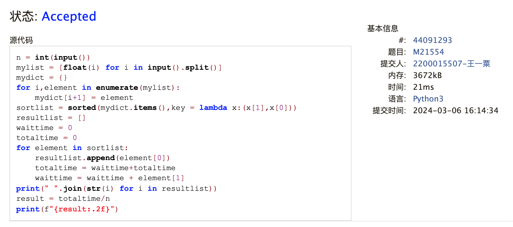
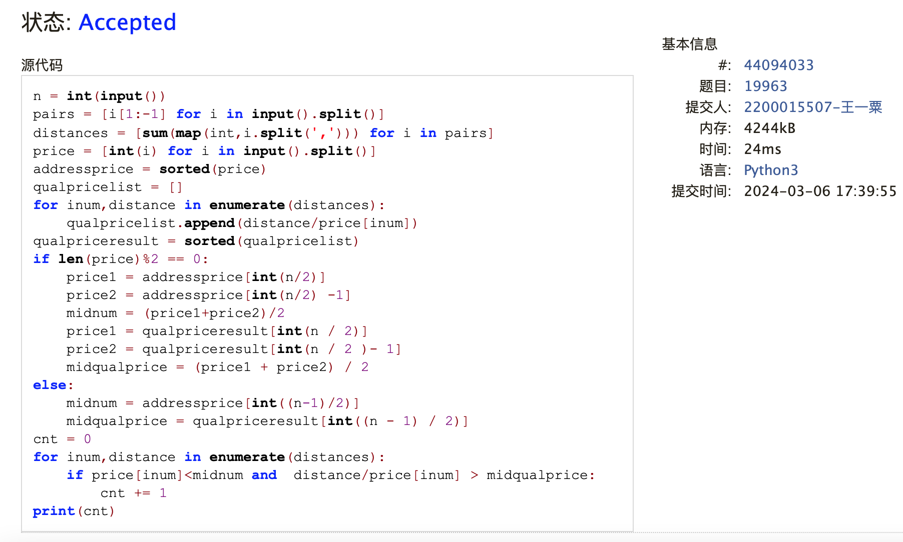
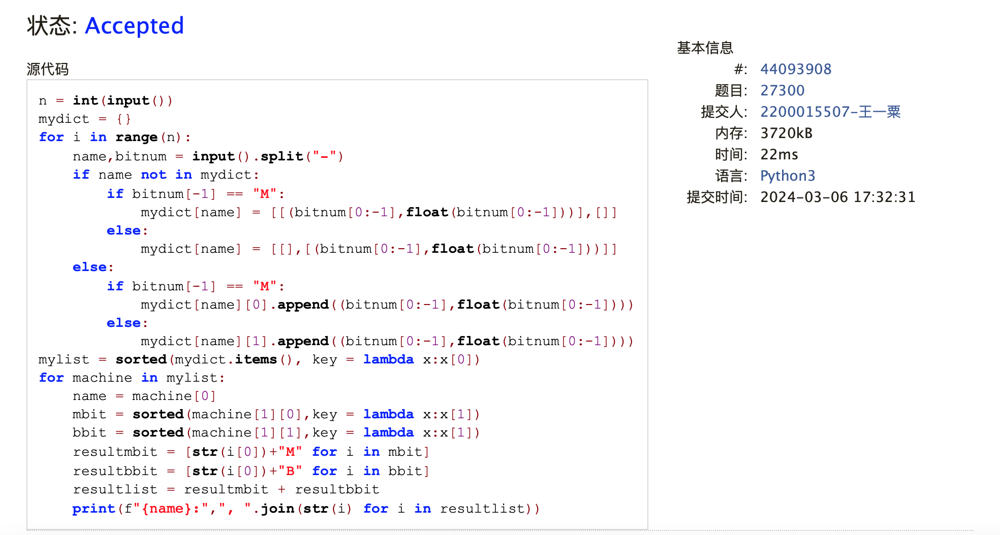

# Assignment #3: March月考

Updated 1537 GMT+8 March 6, 2024

2024 spring, Complied by ==王一粟 经济学院==


**说明：**

1）The complete process to learn DSA from scratch can be broken into 4 parts:
- Learn about Time and Space complexities
- Learn the basics of individual Data Structures
- Learn the basics of Algorithms
- Practice Problems on DSA

2）请把每个题目解题思路（可选），源码Python, 或者C++（已经在Codeforces/Openjudge上AC），截图（包含Accepted），填写到下面作业模版中（推荐使用 typora https://typoraio.cn ，或者用word）。AC 或者没有AC，都请标上每个题目大致花费时间。

3）提交时候先提交pdf文件，再把md或者doc文件上传到右侧“作业评论”。Canvas需要有同学清晰头像、提交文件有pdf、"作业评论"区有上传的md或者doc附件。

4）如果不能在截止前提交作业，请写明原因。


**编程环境**

==（请改为同学的操作系统、编程环境等）==

操作系统：macOS Ventura 13.4.1 (c)

Python编程环境：Spyder IDE 5.2.2, PyCharm 2023.1.4 (Professional Edition)

C/C++编程环境：Mac terminal vi (version 9.0.1424), g++/gcc (Apple clang version 14.0.3, clang-1403.0.22.14.1)


## 1. 题目

**02945: 拦截导弹**

http://cs101.openjudge.cn/practice/02945/


思路：我的思路是用栈做穷举。看到答案思路从尾部遍历要比我的做法简单很多。

耗时：25min

##### 代码

```python
# k = int(input())
mylist = [int(i) for i in input().split()]
stack = [[mylist[0]],[]]
operatelist = []
maxcount = 0
for i in mylist[1:]:
    for sol in stack:
        if sol == []:
            operatelist.append([])
            operatelist.append([i])
        else:
            if i <= sol[-1]:
                operatelist.append(sol)
                operatelist.append(sol + [i])
            else:
                operatelist.append(sol)
    stack = operatelist
    operatelist = []
result = 0
for p in stack:
    if result < len(p):
        result = len(p)
print(result)
```


代码运行截图 ==（至少包含有"Accepted"）==



**04147:汉诺塔问题(Tower of Hanoi)**

http://cs101.openjudge.cn/practice/04147


思路：依据题目思想做递归处理即可。一个很好的构造方式是没有必要设置很多函数，基于起始、终止位置构造一个函数即可。

耗时：25min

##### 代码

```python
#2200015507 王一粟
n,a,b,c = input().split()
n = int(n)

def sol(n,x,y,z):
    if n==1:
        print(f"1:{x}->{z}")
    else:
        sol(n-1,x,z,y)
        print(f"{n}:{x}->{z}")
        sol(n-1,y,x,z)
sol(n,a,b,c)
```

代码运行截图 ==（至少包含有"Accepted"）==



**03253: 约瑟夫问题No.2**

http://cs101.openjudge.cn/practice/03253

思路：同标准约瑟夫问题。只需在append入queue时先从编号为p的人append

耗时：10min

##### 代码

```python
# #2200015507 王一粟
from collections import deque
while True:
    n,p,m = [int(i) for i in input().split()]
    if n == 0:
        break
    myqueue = deque()
    for i in range(p,p+n):
        if i<=n:
            myqueue.append(i)
        else:
            myqueue.append(i-n)
    resultlist = []
    while len(resultlist)<n:
        for k in range(m-1):
            myqueue.append(myqueue.popleft())
        resultlist.append(myqueue.popleft())
    print(",".join(str(i) for i in resultlist))
```

代码运行截图 ==（AC代码截图，至少包含有"Accepted"）==



**21554:排队做实验 (greedy)v0.2**

http://cs101.openjudge.cn/practice/21554


思路：本质上就是先做排序，让时间短的人先开始实验。每次实验时都记录实验时长，算作流逝时间，每次每个人时长再加入总时长里面。同时编号可以用字典保证不乱。

耗时：20min
##### 代码

```python
# #2200015507 王一粟
n = int(input())
mylist = [float(i) for i in input().split()]
mydict = {}
for i,element in enumerate(mylist):
    mydict[i+1] = element
sortlist = sorted(mydict.items(),key = lambda x:(x[1],x[0]))
resultlist = []
waittime = 0
totaltime = 0
for element in sortlist:
    resultlist.append(element[0])
    totaltime = waittime+totaltime
    waittime = waittime + element[1]
print(" ".join(str(i) for i in resultlist))
result = totaltime/n
print(f"{result:.2f}")

```

代码运行截图 ==（AC代码截图，至少包含有"Accepted"）==



**19963:买学区房**

http://cs101.openjudge.cn/practice/19963

思路：先求出中位数，然后根据条件判断达到标准条件的房屋数量。学到的一点是除法返回浮点数，需要用整除或int

耗时：40min
##### 代码

```python
# 2200015507 王一粟
n = int(input())
pairs = [i[1:-1] for i in input().split()]
distances = [sum(map(int,i.split(','))) for i in pairs]
price = [int(i) for i in input().split()]
addressprice = sorted(price)
qualpricelist = []
for inum,distance in enumerate(distances):
    qualpricelist.append(distance/price[inum])
qualpriceresult = sorted(qualpricelist)
if len(price)%2 == 0:
    price1 = addressprice[int(n/2)]
    price2 = addressprice[int(n/2) -1]
    midnum = (price1+price2)/2
    price1 = qualpriceresult[int(n / 2)]
    price2 = qualpriceresult[int(n / 2) - 1]
    midqualprice = (price1 + price2) / 2
else:
    midnum = addressprice[int((n-1)/2)]
    midqualprice = qualpriceresult[int((n - 1) / 2)]
cnt = 0
for inum,distance in enumerate(distances):
    if price[inum]<midnum and distance/price[inum] > midqualprice:
        cnt += 1
print(cnt)
```

代码运行截图 ==（AC代码截图，至少包含有"Accepted"）==



**27300: 模型整理**

http://cs101.openjudge.cn/practice/27300

思路：用字典存储所有的model，value为一个列表，列表中两个元素分别为B和M。字典排序后，对每个model的value分别依据浮点数排序，最后按照规定输出。

耗时：30min

##### 代码

```python
# #2200015507 王一粟
n = int(input())
mydict = {}
for i in range(n):
    name,bitnum = input().split("-")
    if name not in mydict:
        if bitnum[-1] == "M":
            mydict[name] = [[(bitnum[0:-1],float(bitnum[0:-1]))],[]]
        else:
            mydict[name] = [[],[(bitnum[0:-1],float(bitnum[0:-1]))]]
    else:
        if bitnum[-1] == "M":
            mydict[name][0].append((bitnum[0:-1],float(bitnum[0:-1])))
        else:
            mydict[name][1].append((bitnum[0:-1],float(bitnum[0:-1])))
mylist = sorted(mydict.items(), key = lambda x:x[0])
for machine in mylist:
    name = machine[0]
    mbit = sorted(machine[1][0],key = lambda x:x[1])
    bbit = sorted(machine[1][1],key = lambda x:x[1])
    resultmbit = [str(i[0])+"M" for i in mbit]
    resultbbit = [str(i[0])+"B" for i in bbit]
    resultlist = resultmbit + resultbbit
    print(f"{name}:",", ".join(str(i) for i in resultlist))
```

代码运行截图 ==（AC代码截图，至少包含有"Accepted"）==



## 2. 学习总结和收获

==如果作业题目简单，有否额外练习题目，比如：OJ“2024spring每日选做”、CF、LeetCode、洛谷等网站题目。==
第一次尝试老师的月考，AC4。最后两题其实都能在规定时间做出来的，但还是比较细的细节出了问题。

计概C选手可能很多问题确实没有接触过，很多算法也不太懂，比如第一题这种就要从头开始想怎么实现。很多python内置包、逻辑也不如大家掌握的扎实。

最近额外的练习也就是每日一题，自己还是需要点时间消化课堂内容的

看清差距继续努力吧，先努力跟上课程进度。很多算法上的东西慢慢keep up~


