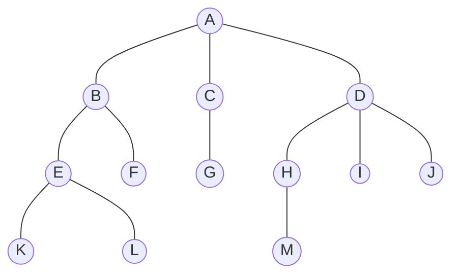

## Course 4: 二叉树基础
### 一、树的术语及基本定义
树是一种非线性数据结构，数据元素在二叉树中按分支关系组织起来，是被用来代表具有层次关系的数据结构。树在包括排序、搜索等很多算法在内，也有很重要的用处。

#### 1. 树的构成
**结点Node**：结点是树的基础部分。每个结点具有名称（键值）。结点还可以保存额外数据项，数据项根据不同的应用而变。

**边Edge**：边是组成树的另一个基础部分。每条边连接两个结点，表示结点之间的关联。边具有出入方向，每个结点（除根结点）恰有一条来自另一结点的入边，每个结点可以有0/1/多条连到其它结点的出边。如果加上没有多条边的限制，则树结构就特殊化为线性表。

**路径Path**：由边依次连接在一起的有序结点列表。

**根结点Root**：树中唯一没有入边的起点（initial point）

**子结点Children**：入边均来自于同一个结点的若干结点，称为这个结点的子结点。

**父结点Parent**：一个结点是其所有出边连接结点的父结点。

**兄弟结点Sibling**：具有同一父结点的结点之间为兄弟结点

**子树Subtree**：一个结点和其所有子孙结点，以及相关边的集合。

**叶结点Leaf Node**：没有子结点的结点称为叶结点

**层级Level**：从根结点开始到达一个结点的路径所包含的边的数量，称为这个结点的层级。显然，根结点的层级为0。

**高度Height/二叉树深度**：树中所有结点的最大层级（空树为-1，只有根结点为0）/看经过的最大边数量

#### 2. 树的正式定义
##### 定义一：传统定义
树由结点及连接结点的边构成，并具备以下属性： （1）有一个根结点 （2）除根结点外，其他每个结点都与其唯一的父结点相连 （3）从根结点到其他每个结点都有且仅有一条路径 （4）如果每个结点最多有**两个**子节点，则树即为二叉树binary tree（一般树称为generic tree）

##### 定义二：递归定义
一棵树要么为空，要么由一个根结点和零棵、一棵或多颗非空子树构成。每棵子树的根结点通过一条边连到父树的根结点。

#### 3. 求二叉树的高度和叶子数目
**输入**

第一行是一个整数n，表示二叉树的结点个数。二叉树结点编号从0到n-1。接下来有n行，依次对应二叉树的编号为0,1,2....n-1的结点。 每行有两个整数，分别表示该结点的左儿子和右儿子的编号。如果第一个（第二个）数为-1则表示没有左（右）儿子

**输出**

在一行中输出2个整数，分别表示二叉树的高度和叶子结点个数
```python
class TreeNode:
    def __init__(self):
        self.left = None
        self.right = None
        #对于generic tree，可以采用first_child....sixth_child(max_num)方式
        #也可以建立动态列表[]
        #也可以建立父结点同第一个子结点的联系，其他的结点可以通过链表连接（self.first_child与self.next_sibling）

def tree_height(node):
    if node is None:
        return -1  # 根据定义，空树高度为-1
    return max(tree_height(node.left), tree_height(node.right)) + 1

def count_leaves(node):
    if node is None:
        return 0
    if node.left is None and node.right is None:
        return 1
    return count_leaves(node.left) + count_leaves(node.right)

n = int(input())  # 读取结点数量
nodes = [TreeNode() for _ in range(n)]
has_parent = [False] * n  # 用来标记结点是否有父结点

for i in range(n):
    left_index, right_index = map(int, input().split())
    if left_index != -1:
        nodes[i].left = nodes[left_index]
        has_parent[left_index] = True
    if right_index != -1:
        #print(right_index)
        nodes[i].right = nodes[right_index]
        has_parent[right_index] = True

# 寻找根结点，也就是没有父结点的结点
root_index = has_parent.index(False)
root = nodes[root_index]

# 计算高度和叶子结点数
height = tree_height(root)
leaves = count_leaves(root)

print(f"{height} {leaves}")
```

### 二、树的表示方法
#### 1.嵌套括号表示法
若一棵树只有一个结点，则该树就用一个大写字母表示，代表其根结点

如果一棵树有子树，则用“树根（子树1，子树2，...子树n）”的形式表示。子树都是用括号嵌套法表示的树。

#### 2.树形表示法
树形表示法即是以树的图像化结构呈现结点之间联系的方式。除此以外，还有基于结点与其子节点关系的表示法，如下图所示。

#### 3.文氏图（Venn diagram）
文氏图是在所谓的集合论数学分支中，在不太严格的意义下用以表示集合&类的一种草图

#### 4.凹入表

#### 5.邻接表表示法（Adjacency List Representation）
邻接表表示法是一种常见的树的表示方法，特别适用于表示稀疏树（树中结点的度数（结点拥有的子树数目）相对较小）。这种表示方法可以有效地存储树的结构，并且可以快速地查找和访问结点的子结点。

在邻接表表示法中，对于每个结点，使用链表或数组等数据结构来存储它的子结点。

假设我们有以下树的结构：

```
       A
     / | \
    B  C  D
   / \    \
  E   F    G
       \
        H
```

使用邻接表表示法，我们可以得到如下的表示：

```
A: ['B', 'C', 'D']
B: ['E', 'F']
E: []
F: ['H']
H: []
C: []
D: ['G']
G: []
```

下面给出定义及输出邻接表表示的方法：
```python
def print_tree_adjacency_list(root):
    adjacency_list = {}

    # 递归构建邻接表
    def build_adjacency_list(node):
        adjacency_list[node.value] = [child.value for child in node.children]
        for child in node.children:
            build_adjacency_list(child)

    # 构建并打印邻接表
    build_adjacency_list(root)
    for node, children in adjacency_list.items():
        print(f"{node}: {children}")
```

#### 5.例题：嵌套括号表示法转遍历序列
遍历序列是二叉树的一种标识方法（根据遍历序列不能唯一的确定二叉树），用L、R、D分别表示遍历左子树、遍历右子树和访问根结点，则有：

**前序遍历**：又称先根序遍历，按照DLR的顺序

**中序遍历**：又称中根序遍历、对程序，按照LDR的顺序

**后序遍历**：又称后根序遍历，按照LRD的顺序

##### （1）类实现方法
```python
class TreeNode:
    def __init__(self, value):
        self.value = value
        self.children = []

def parse_tree(s):
    stack = []
    node = None
    for char in s:
        if char.isalpha():  # 如果是字母，创建新节点
            node = TreeNode(char)
            if stack:  # 如果栈不为空，把节点作为子节点加入到栈顶节点的子节点列表中
                stack[-1].children.append(node)
        elif char == '(':  # 遇到左括号，当前节点可能会有子节点
            if node:
                stack.append(node)  # 把当前节点推入栈中
                node = None
        elif char == ')':  # 遇到右括号，子节点列表结束
            if stack:
                node = stack.pop()  # 弹出当前节点
    return node  # 根节点


def preorder(node):
    output = [node.value]
    for child in node.children:
        output.extend(preorder(child))
    return ''.join(output)

def middle_order(node): #假定括号中只有一个树为左树的二叉树情形
    output = []
    if node.children == []:
        output.append(node.value)
    elif len(node.children) == 1:
        output.extend(middle_order(node.children[0]))
        output.append(node.value)
    else:
        output.extend(middle_order(node.children[0]))
        output.append(node.value)
        output.extend(middle_order(node.children[1]))
    return ''.join(output)
        
def postorder(node):
    output = []
    for child in node.children:
        output.extend(postorder(child))
    output.append(node.value)
    return ''.join(output)

# 主程序
def main():
    s = input().strip()
    s = ''.join(s.split())  # 去掉所有空白字符
    root = parse_tree(s)  # 解析整棵树
    if root:
        print(preorder(root))  # 输出前序遍历序列
        print(middle_order(root)) #输出中序遍历序列
        print(postorder(root))  # 输出后序遍历序列
    else:
        print("input tree string error!")
```
##### （2）字典实现方法
```python
def parse_tree(s):
    stack = []
    node = None
    for char in s:
        if char.isalpha():  # 如果是字母，创建新节点
            node = {'value': char, 'children': []}
            if stack:  # 如果栈不为空，把节点作为子节点加入到栈顶节点的子节点列表中
                stack[-1]['children'].append(node)
        elif char == '(':  # 遇到左括号，当前节点可能会有子节点
            if node:
                stack.append(node)  # 把当前节点推入栈中
                node = None
        elif char == ')':  # 遇到右括号，子节点列表结束
            if stack:
                node = stack.pop()  # 弹出当前节点
    return node  # 根节点


def preorder(node):
    output = [node['value']]
    for child in node['children']:
        output.extend(preorder(child))
    return ''.join(output)

def middle_order(node): #假定括号中只有一个树为左树的二叉树情形
    output = []
    if node['children'] == []:
        output.append(node['value'])
    elif len(node['children']) == 1:
        output.extend(middle_order(node['children'][0]))
        output.append(node['value'])
    else:
        output.extend(middle_order(node['children'][0]))
        output.append(node['value'])
        output.extend(middle_order(node['children'][1]))
    return ''.join(output)

def postorder(node):
    output = []
    for child in node['children']:
        output.extend(postorder(child))
    output.append(node['value'])
    return ''.join(output)

# 主程序
def main():
    s = input().strip()
    s = ''.join(s.split())  # 去掉所有空白字符
    root = parse_tree(s)  # 解析整棵树
    if root:
        print(preorder(root))  # 输出前序遍历序列
        print(middle_order(root)) #输出中序遍历序列
        print(postorder(root))  # 输出后序遍历序列
    else:
        print("input tree string error!")
```

### 三、二叉树的应用
#### 1.解析树
解析树是语法分析结果的一种表现形式，通常以树状表示语言的语法结构.。

##### （一）根据完全括号表达式构建解析树

在将全括号表达式字符串拆分成标记列表后，可以定义以下4条规则：

（1）如果当前标记是（，就为当前结点添加一个左子结点，并下沉至该子结点

（2）如果当前标记是+-*/，就将当前结点的值设为该运算符，同时为当前结点添加一个右子结点，并下沉至该子结点

（3）如果当前标记是数字，就将当前结点的值设为这个数，并返回至父结点

（4）如果当前标记是），就跳到当前结点的父结点

标记当前结点的位置，可以通过currentTree标记完成；增添子结点时，可以通过insertLeft与insertRight函数创建未定义key值（key值为空）的结点；增添key值时，可以通过创建setRootVal构建；返回key值时，可以通过getRootVal构建；为了更好地追踪，同样定义返回子结点的函数getLeftChild与getRightChild；为了标记父结点，可以通过压入栈中进行处理。

traversal函数给予了在解析树后返回三种遍历方式的字符串的函数，以更好地反映对字符串解析后的结果

```python
class Stack(object):
    def __init__(self):
        self.items = []
        self.stack_size = 0

    def isEmpty(self):
        return self.stack_size == 0

    def push(self, new_item):
        self.items.append(new_item)
        self.stack_size += 1

    def pop(self):
        self.stack_size -= 1
        return self.items.pop()

    def peek(self):
        return self.items[self.stack_size - 1]

    def size(self):
        return self.stack_size


class BinaryTree:
    def __init__(self, rootObj):
        self.key = rootObj
        self.leftChild = None
        self.rightChild = None

    def insertLeft(self, newNode):
        if self.leftChild == None:
            self.leftChild = BinaryTree(newNode)
        else:  # 已经存在左子节点。此时，插入一个节点，并将已有的左子节点降一层。
            t = BinaryTree(newNode)
            t.leftChild = self.leftChild
            self.leftChild = t

    def insertRight(self, newNode):
        if self.rightChild == None:
            self.rightChild = BinaryTree(newNode)
        else:
            t = BinaryTree(newNode)
            t.rightChild = self.rightChild
            self.rightChild = t

    def getRightChild(self):
        return self.rightChild

    def getLeftChild(self):
        return self.leftChild

    def setRootVal(self, obj):
        self.key = obj

    def getRootVal(self):
        return self.key

    def traversal(self, method="preorder"):
        if method == "preorder":
            print(self.key, end=" ")
        if self.leftChild != None:
            self.leftChild.traversal(method)
        if method == "inorder":
            print(self.key, end=" ")
        if self.rightChild != None:
            self.rightChild.traversal(method)
        if method == "postorder":
            print(self.key, end=" ")


def buildParseTree(fpexp):
    fplist = fpexp.split()
    pStack = Stack()
    eTree = BinaryTree('')
    pStack.push(eTree)
    currentTree = eTree

    for i in fplist:
        if i == '(':
            currentTree.insertLeft('')
            pStack.push(currentTree)
            currentTree = currentTree.getLeftChild()
        elif i not in '+-*/)':
            currentTree.setRootVal(int(i))
            parent = pStack.pop()
            currentTree = parent
        elif i in '+-*/':
            currentTree.setRootVal(i)
            currentTree.insertRight('')
            pStack.push(currentTree)
            currentTree = currentTree.getRightChild()
        elif i == ')':
            currentTree = pStack.pop()
        else:
            raise ValueError("Unknown Operator: " + i)
    return eTree

exp = "( ( 7 + 3 ) * ( 5 - 2 ) )"
pt = buildParseTree(exp)
for mode in ["preorder", "postorder", "inorder"]:
    pt.traversal(mode)
    print()
"""
* + 7 3 - 5 2 
7 3 + 5 2 - * 
7 + 3 * 5 - 2 
"""
```
根据解析树后的结果，我们也可以计算出该表达式的值。在具体操作上，结合递归的思想，分别处理运算符左子树和右子树的值后返回计算。operator模块给予了计算的便利性。

```python
#代码一：
import operator

def evaluate(parseTree):
    opers = {'+':operator.add, '-':operator.sub, '*':operator.mul, '/':operator.truediv}

    leftC = parseTree.getLeftChild()
    rightC = parseTree.getRightChild()

    if leftC and rightC:
        fn = opers[parseTree.getRootVal()]
        return fn(evaluate(leftC),evaluate(rightC))
    else:
        return parseTree.getRootVal()

#代码二：
#注：函数无返回值时，赋值为None
def postordereval(tree):
    opers = {'+':operator.add, '-':operator.sub,
             '*':operator.mul, '/':operator.truediv}
    res1 = None
    res2 = None
    if tree:
        res1 = postordereval(tree.getLeftChild())
        res2 = postordereval(tree.getRightChild())
        if res1 and res2:
            return opers[tree.getRootVal()](res1,res2)
        else:
            return tree.getRootVal()
```
同样地，我们也可以通过解析树再还原完全括号的表达式，依旧采用递归思想。
```python
def printexp(tree):
    sVal = ""
    if tree:
        sVal = '(' + printexp(tree.getLeftChild())
        sVal = sVal + str(tree.getRootVal())
        sVal = sVal + printexp(tree.getRightChild()) + ')'
    return sVal

#为了规避一个括号中仅有一个数字而没有运算符的情况，我对代码进行了改进
def printexp(tree):
    sVal = ""
    if tree:
        if tree.getLeftChild() != None:
            sVal = '(' + printexp(tree.getLeftChild())
            sVal = sVal + str(tree.getRootVal())
            sVal = sVal + printexp(tree.getRightChild()) + ')'
        else:
            sVal = str(tree.getRootVal())
    return sVal
```

##### 2.根据后序表达式建立队列表达式
队列表达式的求值过程类似于后续表达式，只不过将栈换成了队列：从左到右扫描表达式，碰到操作数就入队列，碰到运算符就从对头取出两个操作数做运算（先出队的是第2个操作数，后出队的是第一个）。计算好结果后，再将结果加入队列中，直至全部扫描队列表达式后，队列里只剩下一个元素，即为表达式的值。

我们可以通过建立起表达式树，按层次遍历表达式树的结果（从上至下，从左至右）前后颠倒就得到队列表达式。

```python
class TreeNode:
    def __init__(self, value):
        self.value = value
        self.left = None
        self.right = None
#该例题中，大写字母表示操作符，小写字母表示操作数
def build_tree(postfix):
    stack = []
    for char in postfix:
        node = TreeNode(char)
        if char.isupper():
            node.right = stack.pop()
            node.left = stack.pop()
        stack.append(node)
    return stack[0]

def level_order_traversal(root):
    queue = [root]
    traversal = []
    while queue:
        node = queue.pop(0)
        traversal.append(node.value)
        if node.left:
            queue.append(node.left)
        if node.right:
            queue.append(node.right)
    return traversal

n = int(input().strip())
for _ in range(n):
    postfix = input().strip()
    root = build_tree(postfix)
    queue_expression = level_order_traversal(root)[::-1]
    print(''.join(queue_expression))
```

#### （二）树的遍历
**遍历**指的是对所有结点的访问。以下是对三种遍历方式的详细定义：

**前序遍历**：先访问根结点，然后递归地前序遍历左子树，最后递归地前序遍历右子树。

**中序遍历**：先递归地中序遍历左子树，然后访问根结点，最后递归地遍历右子树。

**后序遍历**：先递归地后序遍历左子树，然后递归地后序遍历右子树，最后访问根结点。

在构建遍历函数时，我们倾向于将函数放置在二叉树类外，代码相对而言更为简洁，且在函数功能上更为灵活

##### （1）前、中、后序遍历算法
```python
def preorder(tree):
    if tree:
        print(tree.getRootVal())
        preorder(tree.getLeftChild())
        preorder(tree.getRightChild())
        
def inorder(tree):
    if tree != None:
        inorder(tree.getLeftChild())
        print(tree.getRootVal())
        inorder(tree.getRightChild())
        
def postorder(tree):
    if tree != None:
        postorder(tree.getLeftChild())
        postorder(tree.getRightChild())
        print(tree.getRootVal())
```
解析二叉树后，利用二叉树进行后序求值
```python
import operator
def postordereval(tree):
    opers = {'+':operator.add, '-':operator.sub, 
             '*':operator.mul, '/':operator.truediv}
    res1 = None
    res2 = None
    if tree:
        res1 = postordereval(tree.getLeftChild())
        res2 = postordereval(tree.getRightChild())
        if res1 and res2:
            return opers[tree.getRootVal()](res1,res2)
        else:
            return tree.getRootVal()
```
通过中序遍历解析树，可以还原不带括号的表达式，当然亦可以修改代码，得到完全括号表达式。
```python
def printexp(tree):
    sVal = ""
    if tree:
        sVal = '(' + printexp(tree.getLeftChild())
        sVal = sVal + str(tree.getRootVal())
        sVal = sVal + printexp(tree.getRightChild()) + ')'
    return sVal

#为了规避一个括号中仅有一个数字而没有运算符的情况，我对代码进行了改进
def printexp(tree):
    sVal = ""
    if tree:
        if tree.getLeftChild() != None:
            sVal = '(' + printexp(tree.getLeftChild())
            sVal = sVal + str(tree.getRootVal())
            sVal = sVal + printexp(tree.getRightChild()) + ')'
        else:
            sVal = str(tree.getRootVal())
    return sVal
```

##### 2.逻辑运算输出中缀表达式（无不必要括号）
注：优先级从高到低排序为not and or

基于完全括号表达式，输出中缀表达式：

基本思想：先转后缀，再转树，最后由树输出中缀表达式
```python
class BinaryTree:
    def __init__(self, root, left=None, right=None):
        self.root = root
        self.leftChild = left
        self.rightChild = right

    def getrightchild(self):
        return self.rightChild

    def getleftchild(self):
        return self.leftChild

    def getroot(self):
        return self.root

def postorder(string):    #中缀改后缀 Shunting yard algorightm
    opStack = []
    postList = []
    inList = string.split()
    prec = { '(': 0, 'or': 1,'and': 2,'not': 3}

    for word in inList:
        if word == '(':
            opStack.append(word)
        elif word == ')':
            topWord = opStack.pop()
            while topWord != '(':
                postList.append(topWord)
                topWord = opStack.pop()
        elif word == 'True' or word == 'False':
            postList.append(word)
        else:
            while opStack and prec[word] <= prec[opStack[-1]]:
                postList.append(opStack.pop())
            opStack.append(word)
    while opStack:
        postList.append(opStack.pop())
    return postList

def buildParseTree(infix):       #以后缀表达式为基础建树
    postList = postorder(infix)
    stack = []
    for word in postList:
        if word == 'not':  
            newTree = BinaryTree(word)
            newTree.leftChild = stack.pop()
            stack.append(newTree)
        elif word == 'True' or word == 'False':
            stack.append(BinaryTree(word))
        else:
            right = stack.pop()
            left = stack.pop()
            newTree = BinaryTree(word)
            newTree.leftChild = left
            newTree.rightChild = right
            stack.append(newTree)
    currentTree = stack[-1]
    return currentTree

def printTree(parsetree: BinaryTree):
    if parsetree.getroot() == 'or':
        return printTree(parsetree.getleftchild()) + ['or'] + printTree(parsetree.getrightchild())
    elif parsetree.getroot() == 'not':
        return ['not'] + (['('] + printTree(parsetree.getleftchild()) + [')'] if parsetree.leftChild.getroot() not in ['True', 'False'] else printTree(parsetree.getleftchild()))
    elif parsetree.getroot() == 'and':
        leftpart = ['('] + printTree(parsetree.getleftchild()) + [')'] if parsetree.leftChild.getroot() == 'or' else printTree(parsetree.getleftchild())
        rightpart = ['('] + printTree(parsetree.getrightchild()) + [')'] if parsetree.rightChild.getroot() == 'or' else printTree(parsetree.getrightchild())
        return leftpart + ['and'] + rightpart
    else:
        return [str(parsetree.getroot())]

def main():
    infix = input()
    Tree = buildParseTree(infix)
    print(' '.join(printTree(Tree)))

main()
```
个人补充：对于算术运算，在树转中缀过程中，减法情况下：右子树为加减法带括号；乘法情况下，左右边为加减法带括号；除法情况下，左边加减、右边加减乘除带括号

##### 3.二叉树推理
（1）例1：根据二叉树中后序序列建树

假设二叉树的结点里包含一个大写字母，每个结点的大写字母均不同

给定二叉树的中序遍历和后序遍历序列，输出该二叉树的前序遍历序列

推理逻辑：后序遍历的最后一个元素是树的根结点。然后，在中序遍历序列中，根结点将左右子树分开。由此，我们可以寻找到左右子树的中序遍历序列，以及对应子树的后序序列。最后，递归处理子树即可。
```python
def build_tree(inorder, postorder):
    if not inorder or not postorder:
        return []

    root_val = postorder[-1]
    root_index = inorder.index(root_val)

    left_inorder = inorder[:root_index]
    right_inorder = inorder[root_index + 1:]

    left_postorder = postorder[:len(left_inorder)]
    right_postorder = postorder[len(left_inorder):-1]

    root = [root_val]
    root.extend(build_tree(left_inorder, left_postorder))
    root.extend(build_tree(right_inorder, right_postorder))

    return root


def main():
    inorder = input().strip()
    postorder = input().strip()
    preorder = build_tree(inorder, postorder)
    print(''.join(preorder))
```
当然，也可以先解析树（推理方式同上述逻辑），然后再输出前序序列
```python
class TreeNode:
    def __init__(self, x):
        self.val = x
        self.left = None
        self.right = None


def buildTree(inorder, postorder):
    if not inorder or not postorder:
        return None

    # 后序遍历的最后一个元素是当前的根节点
    root_val = postorder.pop()
    root = TreeNode(root_val)

    # 在中序遍历中找到根节点的位置
    root_index = inorder.index(root_val)

    # 构建右子树和左子树
    root.right = buildTree(inorder[root_index + 1:], postorder)
    root.left = buildTree(inorder[:root_index], postorder)

    return root


def preorderTraversal(root):
    result = []
    if root:
        result.append(root.val)
        result.extend(preorderTraversal(root.left))
        result.extend(preorderTraversal(root.right))
    return result


# 读取输入
inorder = input().strip()
postorder = input().strip()

# 构建树
root = buildTree(list(inorder), list(postorder))

# 输出前序遍历序列
print(''.join(preorderTraversal(root)))
```
（2）例2：根据二叉树前中序序列建树

假设二叉树的结点里包含一个大写字母，每个结点的大写字母均不同

给定二叉树的前序遍历和中序遍历序列，输出该二叉树的后序遍历序列

其推理逻辑与例1相同，可根据前序序列锁定root，根据root拆分中序为左子树和右子树，再确定子树前序序列，最后递归。
```python
class TreeNode:
    def __init__(self, value):
        self.value = value
        self.left = None
        self.right = None

def build_tree(preorder, inorder):
    if not preorder or not inorder:
        return None
    root_value = preorder[0]
    root = TreeNode(root_value)
    root_index_inorder = inorder.index(root_value)
    root.left = build_tree(preorder[1:1+root_index_inorder], inorder[:root_index_inorder])
    root.right = build_tree(preorder[1+root_index_inorder:], inorder[root_index_inorder+1:])
    return root

def postorder_traversal(root):
    if root is None:
        return ''
    return postorder_traversal(root.left) + postorder_traversal(root.right) + root.value

while True:
    try:
        preorder = input().strip()
        inorder = input().strip()
        root = build_tree(preorder, inorder)
        print(postorder_traversal(root))
    except EOFError:
        break
```
（3）例3：根据二叉树中后序序列建树，并输出按层次遍历序列

按层次遍历序列指依照层次从根结点到子结点、从左结点到右结点依次输出。在逻辑结构上，队列表达式与按层次遍历表达式树的结果正好相反。
```python
from collections import deque

class Node:
    def __init__(self, data):
        self.data = data
        self.left = None
        self.right = None

def build_tree(inorder, postorder):
    if inorder:
        root = Node(postorder.pop())
        root_index = inorder.index(root.data)
        root.right = build_tree(inorder[root_index+1:], postorder) #爆栈输出[]
        root.left = build_tree(inorder[:root_index], postorder)
        return root

def level_order_traversal(root):
    if root is None:
        return []
    result = []
    queue = deque([root])
    while queue:
        node = queue.popleft()
        result.append(node.data)
        if node.left:
            queue.append(node.left)
        if node.right:
            queue.append(node.right)
    return result

n = int(input())
for _ in range(n):
    inorder = list(input().strip())
    postorder = list(input().strip())
    root = build_tree(inorder, postorder)
    print(''.join(level_order_traversal(root)))
```
（4）例4：解析括号嵌套二叉树

使用括号嵌套的方式表示一棵二叉树的方法如下：

`*`表示空的二叉树。

如果一棵二叉树只有一个结点，则该树就用一个非`*`字符表示，代表其根结点。

如果一棵二叉左右子树都非空，则用`树根(左子树,右子树)`的形式表示。树根是一个非`*`字符,左右子树之间用逗号隔开，没有空格。左右子树都用括号嵌套法表示。如果左子树非空而右子树为空，则用`树根(左子树)`形式表示；如果左子树为空而右子树非空，则用`树根(*,右子树)`形式表示。

目标：根据括号嵌套二叉树，输出其前序遍历和中序遍历序列

思路：先进行二叉树解析--parse_tree函数返回root的value；对于空树返回None，对于单元素直接返回值。对于有子树的情况，基于括号匹配寻找逗号存在的地方，分离左子树与右子树（逗号不存在说明全为左子树）。设定根的左子树和右子树分别为对两子树解析后返回的value。

二叉树解析后，根据解析函数确定根的value。再根据该value用递归函数输出前序与中序遍历序列即可：若根不存在，返回空字符串；否则依据顺序返回左子树、右子树（none情况已被讨论）和value即可。
```python
class TreeNode:
    def __init__(self, value):
        self.value = value
        self.left = None
        self.right = None


def parse_tree(s):
    if s == '*':
        return None
    if '(' not in s:
        return TreeNode(s)

    # Find the root value and the subtrees
    root_value = s[0]
    subtrees = s[2:-1]  # Remove the root and the outer parentheses

    # Use a stack to find the comma that separates the left and right subtrees
    stack = []
    comma_index = None
    for i, char in enumerate(subtrees):
        if char == '(':
            stack.append(char)
        elif char == ')':
            stack.pop()
        elif char == ',' and not stack:
            comma_index = i
            break

    left_subtree = subtrees[:comma_index] if comma_index is not None else subtrees
    right_subtree = subtrees[comma_index + 1:] if comma_index is not None else None

    # Parse the subtrees
    root = TreeNode(root_value)
    root.left = parse_tree(left_subtree)
    root.right = parse_tree(right_subtree) if right_subtree else None
    return root


# Define the traversal functions
def preorder_traversal(root):
    if root is None:
        return ""
    return root.value + preorder_traversal(root.left) + preorder_traversal(root.right)


def inorder_traversal(root):
    if root is None:
        return ""
    return inorder_traversal(root.left) + root.value + inorder_traversal(root.right)


# Input reading and processing
n = int(input().strip())
for _ in range(n):
    tree_string = input().strip()
    tree = parse_tree(tree_string)
    preorder = preorder_traversal(tree)
    inorder = inorder_traversal(tree)
    print(preorder)
    print(inorder)
```

